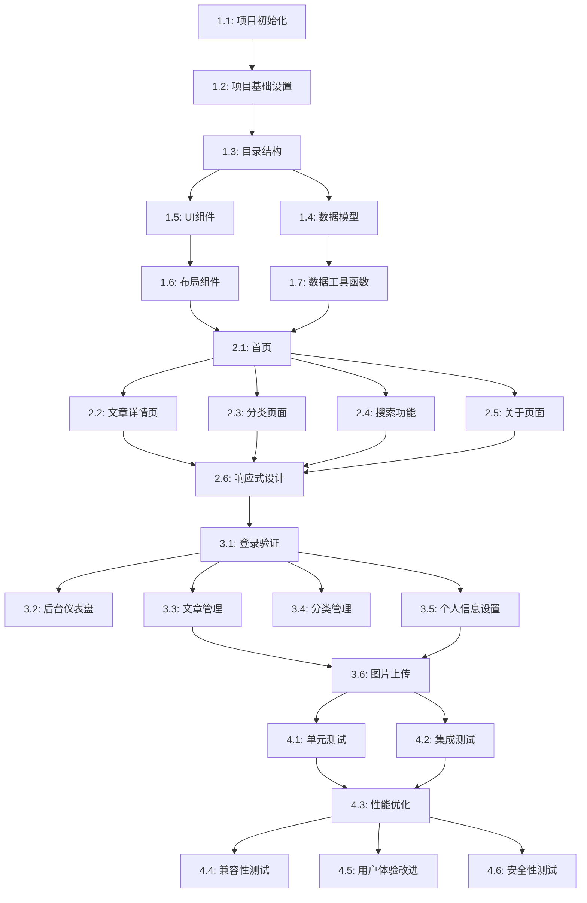

# 徐晓龙个人博客系统 - 项目工作簿

## 项目概览
- **当前阶段**：环境搭建与项目骨架
- **整体进度**：0/25 (0%)
- **近期里程碑**：完成项目初始化与基础组件构建
- **项目状态**：进行中
- **预计完成**：2023-XX-XX

## 项目时间线与里程碑

### 里程碑1: 环境搭建与骨架完成
- **计划日期**: 2023-XX-XX
- **状态**: 进行中
- **包含任务**: 1.1 - 1.7
- **验收标准**:
  - [ ] 项目能成功构建和运行
  - [ ] 所有基础UI组件完成并有文档
  - [ ] 目录结构符合技术文档规范
  - [ ] 类型定义完整

### 里程碑2: 前台功能完成
- **计划日期**: 2023-XX-XX
- **状态**: 未开始
- **包含任务**: 2.1 - 2.6
- **验收标准**:
  - [ ] 所有前台页面功能完整
  - [ ] 响应式设计适配各种设备
  - [ ] 符合UI设计规范
  - [ ] 基本SEO优化完成

### 里程碑3: 后台功能完成
- **计划日期**: 2023-XX-XX
- **状态**: 未开始
- **包含任务**: 3.1 - 3.6
- **验收标准**:
  - [ ] 后台登录和认证系统正常工作
  - [ ] 内容管理功能完整可用
  - [ ] 用户体验流畅，无明显UI问题
  - [ ] 安全措施已实施并测试

### 里程碑4: 测试与优化完成
- **计划日期**: 2023-XX-XX
- **状态**: 未开始
- **包含任务**: 4.1 - 4.6
- **验收标准**:
  - [ ] 单元测试覆盖率达到80%以上
  - [ ] Lighthouse性能得分90+
  - [ ] 所有主要浏览器兼容性测试通过
  - [ ] 安全测试无严重漏洞

## 任务依赖关系

## 任务看板

### 阶段一：环境搭建与项目骨架（2周）

#### 任务1.1：项目初始化与依赖安装
- [ ] **任务描述**: 创建Next.js项目，安装必要依赖
- [ ] **优先级**: P0（关键路径）
- [ ] **依赖任务**: 无
- [ ] **预计耗时**: 2小时
- [ ] **实际耗时**: _待填写_
- [ ] **文档引用**:
  - 技术文档: [技术栈选择](docs/technical-doc.md#2-技术栈选择)
  - 技术文档: [开发工具与环境](docs/technical-doc.md#23-开发工具与环境)
- [ ] **步骤**:
  1. 使用create-next-app创建项目
  2. 安装TailwindCSS、FontAwesome等依赖
  3. 初始化配置文件
- [ ] **完成标准**: 项目能成功启动，基础依赖安装完成

#### 任务1.2：配置项目基础设置
- [ ] **任务描述**: 配置Tailwind CSS、TypeScript等基础设置
- [ ] **优先级**: P0（关键路径）
- [ ] **依赖任务**: 任务1.1
- [ ] **预计耗时**: 3小时
- [ ] **实际耗时**: _待填写_
- [ ] **相关决策**: [DR001: 状态管理策略选择](knowledge-base.md#dr001-状态管理策略选择)
- [ ] **文档引用**:
  - 需求文档: [界面设计](docs/requirements.md#31-界面设计)
  - 技术文档: [整体架构](docs/technical-doc.md#31-整体架构)
- [ ] **步骤**:
  1. 配置tailwind.config.js，添加自定义主题颜色
  2. 配置TypeScript、ESLint和Prettier
- [ ] **完成标准**: 配置文件正确无误，样式能正常应用

#### 任务1.3：创建项目目录结构
- [ ] **任务描述**: 按照技术文档建立项目目录结构
- [ ] **优先级**: P0（关键路径）
- [ ] **依赖任务**: 任务1.2
- [ ] **预计耗时**: 2小时
- [ ] **实际耗时**: _待填写_
- [ ] **相关决策**: [DR002: 项目目录结构设计](knowledge-base.md#dr002-项目目录结构设计)
- [ ] **文档引用**:
  - 技术文档: [目录结构](docs/technical-doc.md#33-目录结构)
- [ ] **步骤**:
  1. 创建主要目录(app, components, lib等)
  2. 创建数据目录和初始JSON文件
- [ ] **完成标准**: 项目目录结构完整，符合技术文档设计

#### 任务1.4：创建数据模型与类型定义
- [ ] **任务描述**: 定义系统所需的TypeScript类型和数据模型
- [ ] **文档引用**:
  - 需求文档: [数据模型设计](docs/requirements.md#5-数据模型设计)
  - 技术文档: [数据库设计](docs/technical-doc.md#4-数据库设计)
- [ ] **步骤**:
  1. 创建Article、Category、User等接口定义
  2. 创建初始JSON数据文件
- [ ] **完成标准**: 类型定义清晰完整，示例数据符合要求

#### 任务1.5：创建基础UI组件
- [ ] **任务描述**: 实现通用UI组件
- [ ] **文档引用**:
  - 原型文件: 查看`docs/index.html`等HTML文件中的UI组件设计
  - 需求文档: [响应式设计策略](docs/requirements.md#7-响应式设计策略)
- [ ] **步骤**:
  1. 创建Button、Input、Card等组件
  2. 实现组件响应式设计
- [ ] **完成标准**: 组件样式符合原型设计，功能正常

#### 任务1.6：创建布局组件
- [ ] **任务描述**: 实现网站布局组件
- [ ] **文档引用**:
  - 原型文件: `docs/index.html`中的整体布局
  - 原型文件: `docs/admin-dashboard.html`中的后台布局
- [ ] **步骤**:
  1. 创建Header、Footer组件
  2. 创建主布局和后台布局组件
- [ ] **完成标准**: 布局组件完整，响应式设计正常工作

#### 任务1.7：实现数据获取工具函数
- [ ] **任务描述**: 创建数据操作工具函数
- [ ] **文档引用**:
  - 技术文档: [API设计](docs/technical-doc.md#5-api设计)
- [ ] **步骤**:
  1. 创建读取JSON文件的API函数
  2. 实现Markdown处理和工具函数
- [ ] **完成标准**: 工具函数能正确工作，没有错误

### 阶段一评价
- [ ] **评价标准**: 项目结构符合设计、基础组件符合原型、技术选型合理

### 阶段二：前台功能实现（3周）

#### 任务2.1：实现首页
- [ ] **任务描述**: 创建博客首页
- [ ] **文档引用**:
  - 原型文件: `docs/index.html`
  - 需求文档: [博客文章列表](docs/requirements.md#211-博客文章列表)
- [ ] **步骤**:
  1. 实现特色文章和文章列表组件
  2. 实现分页和排序功能
- [ ] **完成标准**: 首页功能完整，与原型一致

#### 任务2.2：实现文章详情页
- [ ] **任务描述**: 创建文章详情页
- [ ] **文档引用**:
  - 原型文件: `docs/article.html`
  - 需求文档: [文章详情页](docs/requirements.md#212-文章详情页)
- [ ] **步骤**:
  1. 实现Markdown渲染和代码高亮
  2. 添加相关文章推荐功能
- [ ] **完成标准**: 文章内容完整展示，渲染正确

#### 任务2.3：实现分类页面
- [ ] **任务描述**: 创建分类页面
- [ ] **文档引用**:
  - 原型文件: `docs/categories.html`
  - 需求文档: [分类浏览](docs/requirements.md#213-分类浏览)
- [ ] **步骤**:
  1. 创建分类列表和单个分类页面
  2. 实现分类导航功能
- [ ] **完成标准**: 分类功能完整，展示正确

#### 任务2.4：实现搜索功能
- [ ] **任务描述**: 创建搜索功能
- [ ] **文档引用**:
  - 原型文件: `docs/search.html`
  - 需求文档: [搜索功能](docs/requirements.md#214-搜索功能)
- [ ] **步骤**:
  1. 实现搜索API和搜索结果组件
  2. 添加关键词高亮功能
- [ ] **完成标准**: 搜索功能正常，结果准确

#### 任务2.5：实现关于页面
- [ ] **任务描述**: 创建关于页面
- [ ] **文档引用**:
  - 原型文件: `docs/about.html`
  - 需求文档: [关于页面](docs/requirements.md#215-关于页面)
- [ ] **步骤**:
  1. 创建博主信息展示组件
  2. 添加联系方式和社交链接
- [ ] **完成标准**: 页面内容完整，样式符合设计

#### 任务2.6：实现响应式设计
- [ ] **任务描述**: 优化响应式设计
- [ ] **文档引用**:
  - 需求文档: [响应式设计](docs/requirements.md#216-响应式设计)
  - 需求文档: [响应式设计策略](docs/requirements.md#7-响应式设计策略)
- [ ] **步骤**:
  1. 优化所有页面的响应式布局
  2. 实现移动端导航菜单
- [ ] **完成标准**: 所有页面在各设备上显示良好

### 阶段二评价
- [ ] **评价标准**: 前台页面与原型一致、响应式设计满足需求、用户体验流畅

### 阶段三：后台功能实现（3周）

#### 任务3.1：实现登录验证
- [ ] **任务描述**: 创建后台登录功能
- [ ] **文档引用**:
  - 原型文件: `docs/admin-login.html`
  - 需求文档: [登录验证](docs/requirements.md#221-登录验证)
  - 技术文档: [身份验证安全](docs/technical-doc.md#81-身份验证安全)
- [ ] **步骤**:
  1. 创建登录页面和认证上下文
  2. 实现JWT验证和状态保持
- [ ] **完成标准**: 登录功能安全可靠

#### 任务3.2：实现后台仪表盘
- [ ] **任务描述**: 创建后台仪表盘
- [ ] **文档引用**:
  - 原型文件: `docs/admin-dashboard.html`
- [ ] **步骤**:
  1. 创建统计卡片和图表组件
  2. 添加最近文章列表
- [ ] **完成标准**: 仪表盘展示统计信息，界面友好

#### 任务3.3：实现文章管理
- [ ] **任务描述**: 创建文章管理功能
- [ ] **文档引用**:
  - 原型文件: `docs/admin-articles.html` 和 `docs/admin-article-edit.html`
  - 需求文档: [文章管理](docs/requirements.md#222-文章管理)
- [ ] **步骤**:
  1. 创建文章列表和编辑页面
  2. 实现Markdown编辑器
- [ ] **完成标准**: 文章管理功能完整，编辑器易用

#### 任务3.4：实现分类管理
- [ ] **任务描述**: 创建分类管理功能
- [ ] **文档引用**:
  - 原型文件: `docs/admin-categories.html`
  - 需求文档: [分类管理](docs/requirements.md#223-分类管理)
- [ ] **步骤**:
  1. 创建分类列表和表单组件
  2. 实现分类CRUD操作
- [ ] **完成标准**: 分类管理功能完整，交互友好

#### 任务3.5：实现个人信息设置
- [ ] **任务描述**: 创建个人信息设置页面
- [ ] **文档引用**:
  - 原型文件: `docs/admin-settings.html`
  - 需求文档: [个人信息设置](docs/requirements.md#224-个人信息设置)
- [ ] **步骤**:
  1. 创建个人资料、博客设置和安全设置组件
  2. 实现设置更新功能
- [ ] **完成标准**: 设置功能完整，界面友好

#### 任务3.6：实现图片上传功能
- [ ] **任务描述**: 添加图片上传功能
- [ ] **文档引用**:
  - 原型文件: `docs/admin-article-edit.html`中的上传功能
  - 原型文件: `docs/admin-settings.html`中的头像上传
- [ ] **步骤**:
  1. 创建通用上传组件
  2. 集成到文章编辑器和个人设置
- [ ] **完成标准**: 上传功能稳定，支持预览

### 阶段三评价
- [ ] **评价标准**: 后台功能完整、操作流程符合用户习惯、安全性得到保障

### 阶段四：测试与性能优化（2周）

#### 任务4.1：单元测试
- [ ] **任务描述**: 编写单元测试
- [ ] **文档引用**: 
  - 技术文档: [开发规范](docs/technical-doc.md#11-开发规范)
- [ ] **步骤**:
  1. 为API函数编写单元测试
  2. 为关键组件编写单元测试
- [ ] **完成标准**: 关键功能有测试覆盖，通过率高

#### 任务4.2：集成测试
- [ ] **任务描述**: 执行集成测试
- [ ] **步骤**:
  1. 测试页面间交互
  2. 测试数据流程的完整性
- [ ] **完成标准**: 主要用户流程测试通过

#### 任务4.3：性能优化
- [ ] **任务描述**: 优化网站性能
- [ ] **文档引用**: 
  - 技术文档: [性能优化策略](docs/technical-doc.md#9-性能优化策略)
  - 需求文档: [性能要求](docs/requirements.md#32-性能要求)
- [ ] **步骤**:
  1. 优化图片加载
  2. 实现组件懒加载
  3. 配置API缓存
- [ ] **完成标准**: Lighthouse性能分数达到90+

#### 任务4.4：兼容性测试
- [ ] **任务描述**: 测试浏览器兼容性
- [ ] **文档引用**: 
  - 需求文档: [兼容性要求](docs/requirements.md#35-兼容性要求)
- [ ] **步骤**:
  1. 在Chrome、Firefox、Safari、Edge中测试
  2. 在iOS和Android设备上测试
- [ ] **完成标准**: 各浏览器表现一致

#### 任务4.5：用户体验改进
- [ ] **任务描述**: 优化用户体验
- [ ] **文档引用**: 
  - 需求文档: [可用性要求](docs/requirements.md#34-可用性要求)
- [ ] **步骤**:
  1. 优化交互反馈
  2. 完善错误提示
  3. 改进无障碍功能
- [ ] **完成标准**: 用户反馈积极，无障碍测试通过

#### 任务4.6：安全性测试
- [ ] **任务描述**: 进行安全测试
- [ ] **文档引用**: 
  - 技术文档: [安全性考虑](docs/technical-doc.md#8-安全性考虑)
- [ ] **步骤**:
  1. 进行XSS和CSRF测试
  2. 检查API安全性
  3. 审查身份验证流程
- [ ] **完成标准**: 无严重安全漏洞，符合安全最佳实践

### 阶段四评价
- [ ] **评价标准**: 系统稳定可靠、性能良好、无明显安全隐患

## 问题跟踪

### 未解决问题

#### ISSUE-001: 项目初始化示例问题
- **状态**: 待解决
- **优先级**: 中
- **报告日期**: 2023-XX-XX
- **关联任务**: 任务1.1
- **问题描述**: 使用create-next-app初始化项目时可能遇到的Node.js版本兼容性问题
- **复现步骤**:
  1. 使用Node.js v16运行create-next-app
  2. 选择最新的Next.js 14版本
  3. 可能出现依赖冲突警告
- **已尝试解决方案**:
  1. 尚未尝试解决方案
- **下一步计划**: 升级Node.js至v18或更高版本

### 已解决问题

#### ISSUE-002: 示例已解决问题
- **状态**: 已解决
- **解决日期**: 2023-XX-XX
- **关联任务**: 任务1.1
- **问题描述**: 这是一个示例已解决问题的格式
- **解决方案**: 这里描述如何解决此问题的步骤和方法
- **知识库记录**: [KB001: Next.js 14的App Router基础结构](knowledge-base.md#kb001-nextjs-14的app-router基础结构)

## 检查点记录

### 检查点1: 项目初始规划检查点
- **日期**: 2023-XX-XX
- **参与者**: 徐晓龙
- **检查内容**:
  - 文档结构与完整性
  - 任务拆分合理性
  - 技术选型评估
- **结论**:
  - 文档结构完善，覆盖了项目管理和技术实现的关键方面
  - 任务拆分详细且有序，符合开发逻辑
  - 技术选型现代且合适，符合项目需求
- **行动项**:
  1. 完善里程碑时间计划
  2. 考虑为关键组件添加详细设计文档
  3. 研究Next.js 14的最佳实践

## 工作日志

### 2023-XX-XX（今日日期）

#### 今日完成
- 项目初始规划
- 文档结构优化
- 创建project-workbook.md和knowledge-base.md

#### 时间分配
- 开发编码: 0小时
- 文档写作: 3小时
- 项目规划: 2小时
- 总计: 5小时

#### 当前状态
- 准备开始任务1.1：项目初始化与依赖安装
- 环境已准备就绪

#### 明日计划
- 完成任务1.1：项目初始化与依赖安装（预计2小时）
- 开始任务1.2：配置项目基础设置（预计3小时）
- 更新知识库：记录项目初始化过程中的经验

#### 今日遇到的问题
- 无

### 工作备注
- 需留意Next.js 14的新特性，特别是App Router的使用方式
- 考虑使用pnpm替代npm提高依赖安装速度

## 周报摘要

### 第1周（2023-XX-XX至2023-XX-XX）

#### 本周完成
- 文档结构搭建
- 项目规划与任务拆分

#### 时间统计
- 开发编码: 0小时
- 文档写作: 5小时
- 项目规划: 3小时
- 总计: 8小时

#### 下周计划
- 完成阶段一的任务1.1至1.4
- 撰写项目README和基础配置文档

#### 风险与问题
- Node.js版本兼容性问题（ISSUE-001）
- 项目依赖选型仍需进一步评估 